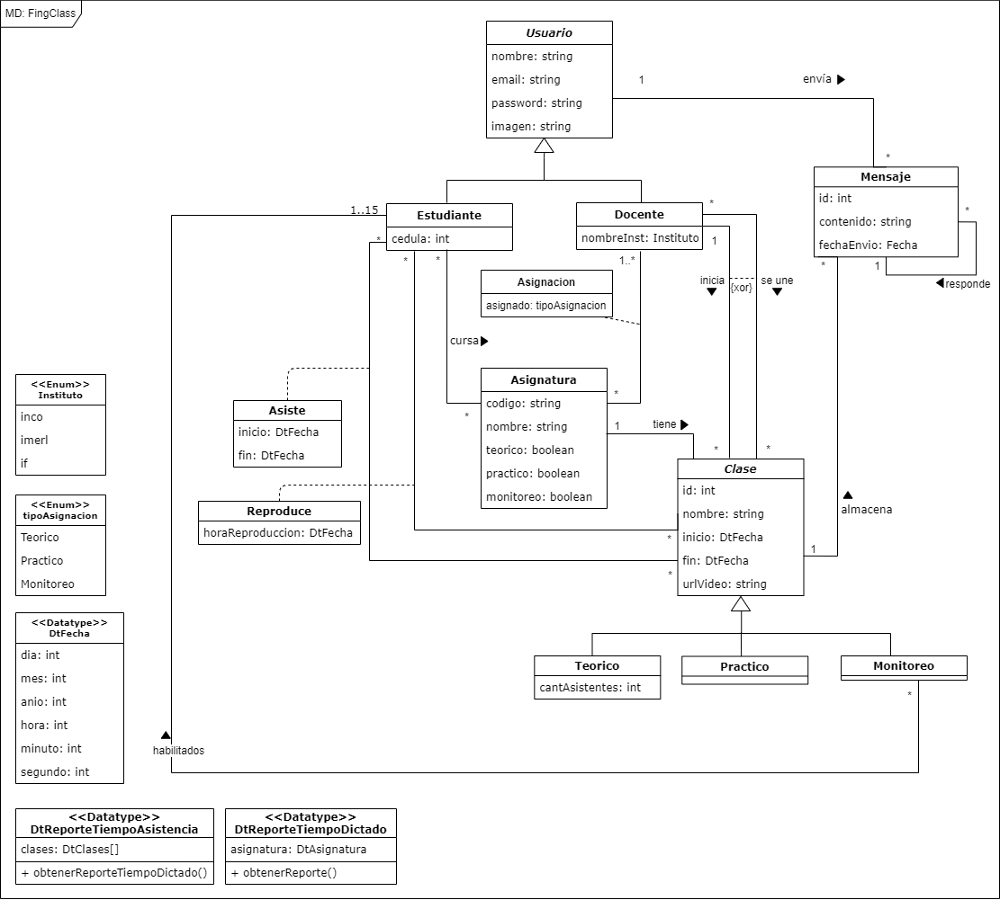
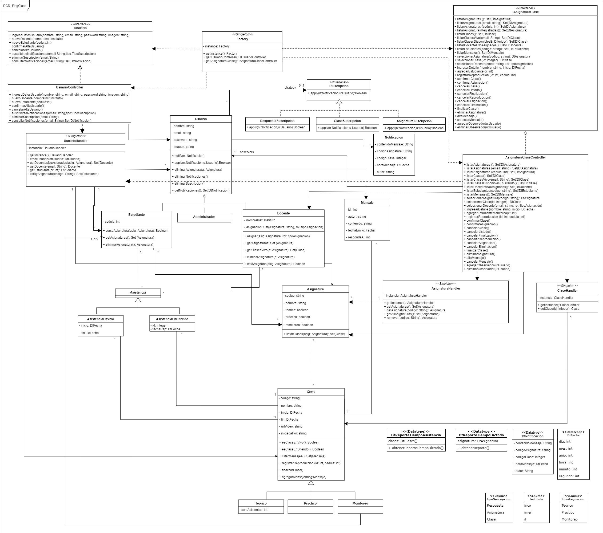

# FingClass

### Introducción

Atenta a la situación de pandemia por el COVID-19, la Facultad de Ingeniería le ha propuesto a su
Equipo de Desarrollo la construcción de la aplicación FingClass con el objetivo de dar soporte a la
modalidad de dictado a distancia de todos sus cursos. Esta aplicación debe permitir a los estudiantes
asistir a clases en vivo o en diferido dictadas por uno o varios docentes.

### Para compilar

Ejecutar el comando `make` en la raiz del proyecto donde se encuentra el **makefile**.

### Para ejecutar el sistema

Situado en la carpeta bin ejecutar `./bin/FingClass` (idem pero con .exe para Windows).

### [Casos de uso](./docs/casosDeUso.md)

--------

### [Diagramas de secuencia del sistema](./docs/DSS.md)

--------

### [Diagramas de Comunicación](./docs/diagramasDeComunicacion.md)

--------

--------

### DCD

